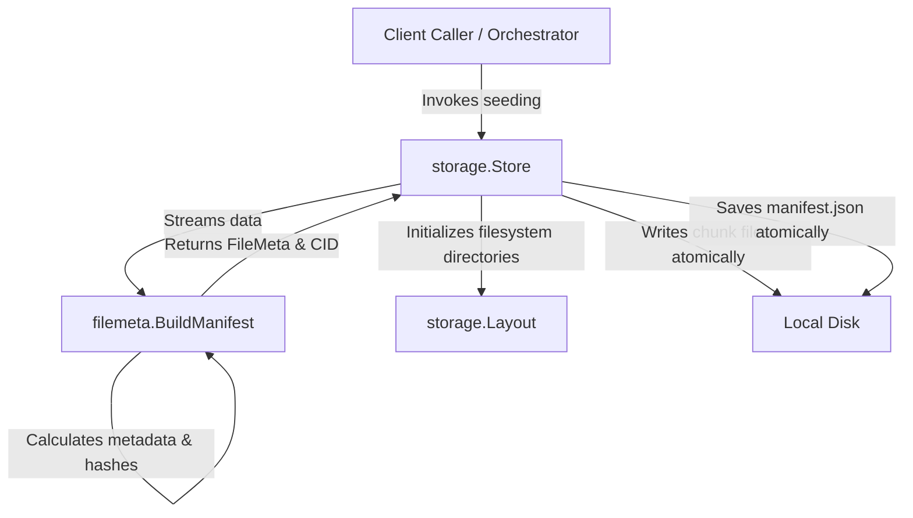

# Architecture & Developer Integration Manual: filemeta & storage

This document provides a comprehensive, production-grade technical breakdown of the `filemeta` and `storage` layers within the P2P Model Distribution system. It is designed to enable any incoming engineer to immediately understand the system's design, operational invariants, and codebase conventions.

---

## 1. High-Level Architectural Vision

The P2P Model Distribution system splits large machine learning models and data files into uniform chunks, computes cryptographic proofs, verifies chunk integrity in parallel, and manages local disk persistence. 

To achieve high testability and clean domain boundary isolation, the codebase enforces a strict separation of concerns between analytical metadata generation and hardware/filesystem operations:



### Separation of Concerns
1. **`filemeta` Package**: The pure, functional core. It contains no stateful I/O assumptions. It is responsible for parsing byte streams, hashing, formulating logical structures, and validating integrity.
2. **`storage` Package**: The stateful driver. It translates logical data structures into physical disk constructs. It handles directory hierarchy standardization, thread-safe memory mapping, and atomic file serialization.

---

## 2. Core Domain Types (`filemeta/types.go`)

These structs act as the common language shared between the P2P networking node, the metadata verifiers, and the local filesystem storage drivers.

### `ChunkMeta`
Represents the structural definition of an individual file slice.
```go
type ChunkMeta struct {
	Index int    `json:"index"` // 0-indexed position of the chunk in the file sequence
	CID   string `json:"cid"`   // Content Identifier (hash-based) for the chunk
	Hash  string `json:"hash"`  // Cryptographic checksum of the chunk (prefixed with sha256:)
	Size  int    `json:"size"`  // Actual byte size of the chunk (equal to ChunkSize except for the final chunk)
}
```

### `FileMeta`
Represents the overall file manifest structure.
```go
type FileMeta struct {
	FileID    string      `json:"file_id"`    // Unique alphanumeric namespace identifier
	FileName  string      `json:"file_name"`  // Original filename of the source model
	FileSize  int64       `json:"file_size"`  // Total size of the file in bytes
	ModelHash string      `json:"model_hash"` // Cryptographic SHA-256 hash of the entire file
	ChunkSize int         `json:"chunk_size"` // Standard target chunk size (bytes)
	NumChunks int         `json:"num_chunks"` // Total number of chunk partitions
	Version   string      `json:"version"`    // Format schema version (currently v1)
	CreatedAt int64       `json:"created_at"` // Unix timestamp indicating generation time
	Chunks    []ChunkMeta `json:"chunks"`     // Contiguous array of metadata for each chunk partition
}
```

### `DownloadState`
Tracks active download progress and validation statuses.
```go
type DownloadState struct {
	FileID     string          `json:"file_id"`    // Associated FileID namespace
	Status     string          `json:"status"`     // Global status label (e.g. downloading, active, verified)
	Downloaded map[string]bool `json:"downloaded"` // Map tracking chunk download status (keyed by CID)
	Verified   map[string]bool `json:"verified"`   // Map tracking cryptographic validation status (keyed by CID)
	UpdatedAt  int64           `json:"updated_at"` // Unix timestamp of the last status alteration
}
```

---

## 3. The `filemeta` Package: Analytical Computations

The `filemeta` package operates entirely on stream interfaces (`io.Reader`, `io.Writer`) and values.

### 3.1 Chunker & Manifest Builder (`manifest.go`)

#### `BuildManifest`
```go
func BuildManifest(
	src io.Reader,
	fileID string,
	fileName string,
	fileSize int64,
	chunkSize int,
) (FileMeta, string, error)
```
* **What it does**: Reads a raw byte stream and generates the corresponding logical `FileMeta` along with a stable Content Identifier (CID).
* **Nuances**:
  * **Fallback**: If `chunkSize` is `<= 0`, it defaults to `DefaultChunkSize` (1MB).
  * **Hashing Tee-Reader**: It utilizes an `io.TeeReader` that feeds all bytes consumed by the chunking buffer directly into a `sha256.New()` stream. This allows the function to calculate individual chunk hashes and the global `ModelHash` in a single read pass over the source data.
  * **Memory Safety**: Uses a pre-allocated byte slice of length `chunkSize` to read blocks via `io.ReadFull`. This avoids excessive memory allocations during ingestion of gigabyte-scale files.

#### `GenerateManifestCID`
```go
func GenerateManifestCID(meta FileMeta) (string, error)
```
* **What it does**: Computes a stable, content-derived unique hash representing the manifest.
* **Nuances**:
  * **Stability Rule**: Local attributes (`FileID`, `FileName`, `CreatedAt`) are stripped before hashing. This guarantees that two distinct peers on the network indexing the exact same file content with different names or local identifiers will generate the exact same manifest CID.
  * **Implementation**: The stable metadata fields (`FileSize`, `ModelHash`, `ChunkSize`, `NumChunks`, `Version`, `Chunks`) are mapped into a local `StableMeta` struct, serialized to JSON, and hashed via SHA-256.

### 3.2 File Reassembly (`assembler.go`)

#### `AssembleChunks`
```go
func AssembleChunks(chunkDir, outputPath string, chunks []ChunkMeta) error
```
* **What it does**: Reads isolated chunk files from a directory, sorts them sequentially, and merges them into a single file.
* **Nuances**:
  * **Sort Isolation**: To prevent mutating the caller's slice, it creates a local deep copy of the `chunks` slice before sorting.
  * **Layout Continuity Verification**: It iterates through the sorted slice and verifies that the chunk index matches the iteration index exactly:
    ```go
    if c.Index != i {
        return fmt.Errorf("invalid chunk layout...")
    }
    ```
    This prevents file assembly corruption in cases where chunks are missing or gaps exist.

### 3.3 Verification Engine (`verifier.go`)

#### `VerifyAllChunks`
```go
func VerifyAllChunks(chunkDir string, chunks []ChunkMeta) []int
```
* **What it does**: Validates the cryptographic integrity of every chunk file saved in the target storage directory.
* **Nuances**:
  * **Worker Pool Parallelization**: To scale across high-CPU and high-I/O hardware environments, it spins up a pool of concurrent workers (bounded by `runtime.NumCPU()`).
  * **Task Scheduling**: It routes validation tasks to workers using a channel. Failed chunk indices are sent to a thread-safe collector channel, which is then drained and sorted deterministically before returning to the caller.
  * **Worker Leak Prevention**: All channel closures are structured using a `sync.WaitGroup` to guarantee clean goroutine teardowns under any error condition.

---

## 4. The `storage` Package: Persistence Layer

The `storage` package manages how the physical storage engine writes and reads model components from disk.

### 4.1 Path Standardizer (`layout.go`)
Standardizes file mappings. By using `NewLayout(baseDir)`, directories can be configured dynamically to support custom storage mounts.

```go
type Layout struct {
	baseDir string
}
```
* **`FileDir(fileID)`**: Resolves to `<baseDir>/<fileID>/`.
* **`ChunksDir(fileID)`**: Resolves to `<baseDir>/<fileID>/chunks/`.
* **`ManifestPath(fileID)`**: Resolves to `<baseDir>/<fileID>/manifest.json`.
* **`StatePath(fileID)`**: Resolves to `<baseDir>/<fileID>/state.json`.

### 4.2 Local Disk Driver (`store.go`)
Implements read, write, and directory management APIs.

* **`InitializeFileDirectories(fileID)`**: Prepares layout subfolders on disk using `os.MkdirAll` with directory mask `0755`.
* **`WriteChunk` / `SaveManifest` (Atomic Write Guarantee)**:
  To prevent corrupted files during system crashes, the store writes to a temporary file (`.tmp`) first. Once the write succeeds and files are flushed to disk, the temporary file is renamed to the final destination:
  ```go
  tmpPath := chunkPath + ".tmp"
  if err := os.WriteFile(tmpPath, data, 0644); err != nil { ... }
  if err := os.Rename(tmpPath, chunkPath); err != nil { ... }
  ```
* **`StoreModel`**: The integration controller. It opens a file, generates metadata via `filemeta.BuildManifest`, seeks back to the start of the stream, writes chunk partitions via `WriteChunksFromReader`, and serializes the final manifest to disk.

### 4.3 Thread-Safe State Tracker (`state.go`)
Maintains progress states in multi-threaded environments where multiple network workers download/verify chunks simultaneously.

```go
type StateStore struct {
	mu       sync.RWMutex
	filePath string
	state    *filemeta.DownloadState
}
```
* **Concurrency Lock Isolation**: Writes use `ss.mu.Lock()`, whereas reads use `ss.mu.RLock()`.
* **Map Deep-Copy**: Since Go maps are references and prone to concurrent read/write panics, `GetState()` locks the mutex, allocates new maps, and performs deep copies of the internal state values before returning:
  ```go
  stateCopy := *ss.state
  stateCopy.Downloaded = make(map[string]bool)
  for k, v := range ss.state.Downloaded {
      stateCopy.Downloaded[k] = v
  }
  ```
* **Atomic Save**: Serialization is executed atomically inside the write lock using `f.Sync()` before swapping via `os.Rename`.

---

## 5. Sequence Traces

### 5.1 Model Seeding Flow
```
User / Seeder Node                         storage.Store                 filemeta (Pure)
     |                                           |                             |
     |--- StoreModel(srcPath, ID, 0) ----------->|                             |
     |                                           |--- BuildManifest() -------->|
     |                                           |                             | [Read & Hash Loop]
     |                                           |<-- Returns FileMeta, CID ---|
     |                                           |                             |
     |                                           |--- WriteChunksFromReader()  |
     |                                           |    (Iterative .tmp rename)  |
     |                                           |                             |
     |                                           |--- SaveManifest() ----------|
     |                                           |    (Atomic JSON swap)       |
     |<-- Returns Metadata & CID ----------------|                             |
```

### 5.2 Verification & Reassembly Flow
```
Network/Orchestrator                       storage.Store                 filemeta (Pure)
     |                                           |                             |
     |--- LoadManifest(fileID) ----------------->|                             |
     |<-- Returns FileMeta ----------------------|                             |
     |                                                                         |
     |--- VerifyAllChunks(chunksDir, manifest.Chunks) ------------------------>|
     |                                                                         | [Concurrent Workers]
     |<-- Returns list of failed chunk indices --------------------------------|
     |                                                                         |
     |--- AssembleChunks(chunksDir, outPath, chunks) ------------------------->|
     |                                                                         | [Sort & Merge]
     |<-- Reassembled File Output ---------------------------------------------|
```

---

## 6. Guidelines for Contributors

### Verification Checklist
When making modifications to either the persistence layer (`storage`) or metadata calculation layer (`filemeta`), verify the changes against the testing protocols:

1. **Verify Race Conditions**:
   Run all tests with the race detector enabled to ensure that locking mechanisms inside the `StateStore` are behaving as expected:
   ```bash
   go test -race ./...
   ```
2. **Clear Test Cache**:
   Ensure you force Go to re-run all test logic instead of retrieving cached success logs:
   ```bash
   go test -count=1 ./...
   ```

### Conventions to Maintain
* **Atomic Writes**: Any filesystem write in `storage` must be performed through a `.tmp` file and swapped using `os.Rename`. Direct writes to production targets are strictly prohibited.
* **Separation of Concerns**: Do not import `os`, `path/filepath`, or perform disk operations in any core logic functions in `filemeta` (e.g. `BuildManifest`, `AssembleChunks`, `VerifyAllChunks` should work on parameters and stream interfaces).
* **Map Memory Access**: Never expose raw maps from internal synchronized structures. Always copy maps inside read locks.
